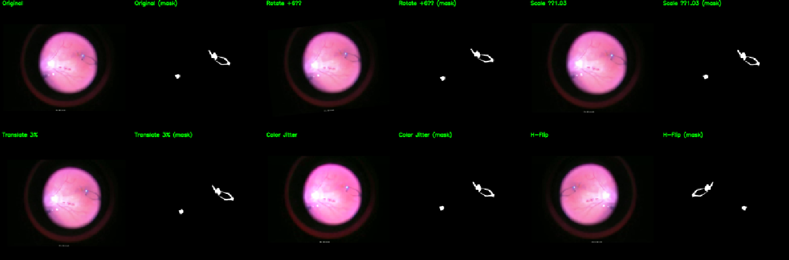
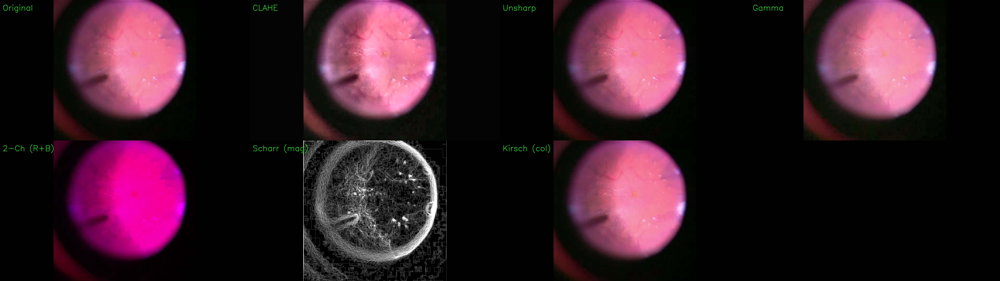
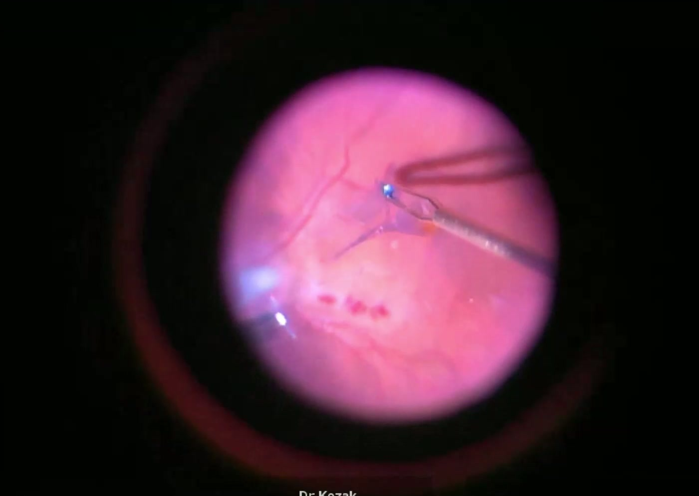
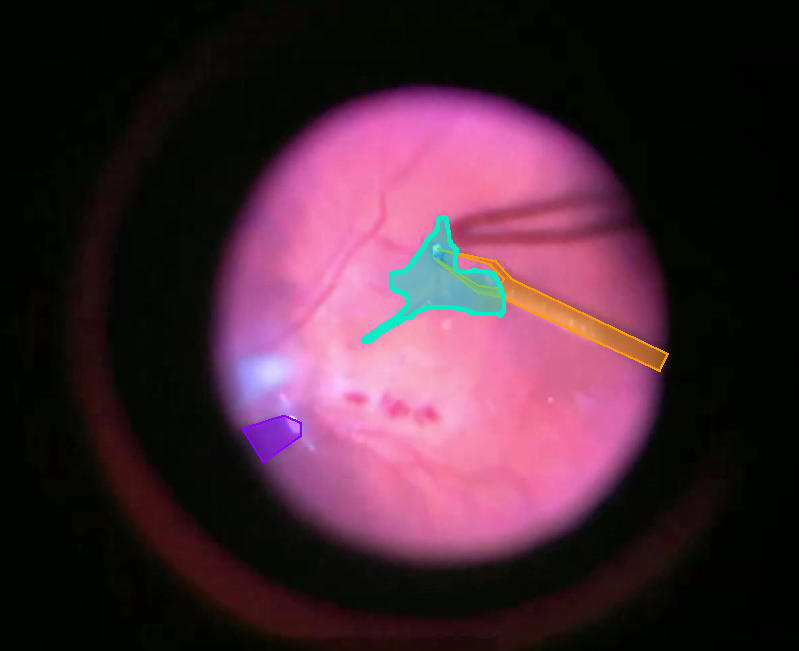
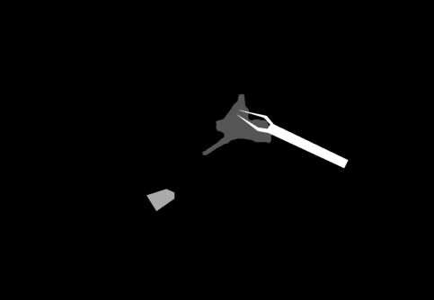
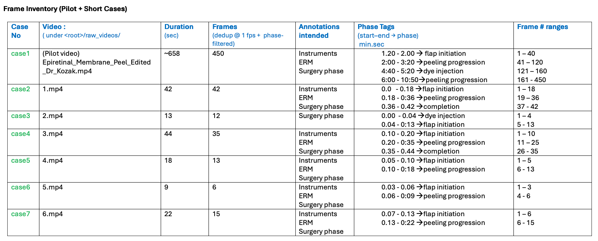

### TESTS : [](https://github.com/vsi-lab/retinal_segmentation/actions/workflows/ci.yml)


# Retinal Segmentation (Data ➜ Training ➜ Evaluation)

End-to-end pipeline for **retinal surgery image segmentation** (e.g., ERM + instruments) using **Supervisely** annotations.  
The repo provides:

- **Data prep**: frame extraction (FFmpeg), de-dup (SSIM), blur filter,  Supervisely integration, black-border crop, multi-class → binary masks, case-based splits.
- **Training (to be extended)**: datasets, baseline models (U-Net++, DeepLabV3+, TransUNet, and a U-Net baseline), on-the-fly resize/augment.
- **Evaluation (to be extended)**: Dice/IoU, boundary F1, qualitative overlays.
- **Reproducibility** via `config.yaml`, idempotent steps, and per-step metadata.

---
## System Architecture


```text
                     ┌──────────────────────────────────────────────────┐
                     │     Retinal ERM Surgical Segmentation Pipeline   │
                     └──────────────────────────────────────────────────┘

   Raw Surgical Video Frames (frames/)
                 │
                 ▼
┌──────────────────────────────────────┐
│ Preprocessing                        │
│  • Frame extraction                  │
│  • Frame deduplication               │
│  • Deblur / denoise                  │
│  • Image enhancements (CLAHE etc.)   │
│  • Annotate + greyscale mask         │
|     generation using Supervisely     │
│  • Crop black regions (image+mask)   │
│  • Resize (image+mask)               │
│  • Metadata file + efficient         │
|       test/train/val split           │
└──────────────────────────────────────┘
                 │
                 ▼
┌──────────────────────────────────────┐
│ Augmentation (train only)            │
│  • HorizontalFlip, Rotate, Translate │
│  • Brightness/Contrast, Gamma        │
│  • Despeckle & Blur variants         │
│  • Applied with prob p (orig+aug mix)│
└──────────────────────────────────────┘
                 │
                 ▼
       ┌─────────────────┐
       │  DataLoader     │
       │  (CHW tensors)  │
       └─────────────────┘
                 │
                 ▼
   ┌────────────────────────────────┐
   │ TransUNet Segmentation Model   │
   │  • CNN encoder + ViT blocks    │
   │  • Decoder + skip connections  │
   │                                │   
   │  Train on U-Net++/Mask2Former, │
   |    TernausNet also             │
   └────────────────────────────────┘
                 │
                 ▼
   ┌────────────────────────────────┐
   │ Training Loop                  │
   │  • Dice + Focal composite loss │
   │  • Checkpoints (best.ckpt)     │
   └────────────────────────────────┘
                 │
                 ▼
   ┌────────────────────────────────┐
   │ Evaluation & Visualization     │
   │  • Dice / IoU metrics          │
   │  • prediction vs. annotation   │
   │  • augmentation preview panels │
   └────────────────────────────────┘
                 │
                 ▼
   ┌────────────────────────────────┐
   │ (Future extension)             │
   │  • Disease-level prediction    │
   │  • XAI visualization (SHAP etc.)│
   └────────────────────────────────┘

```

---

## Note on Models to train

In order of experiment choice.
- Unet++ : Gold standard baseline for segmentation. Baseline & First choice.
- TernausNet (VGG-U-Net): main advantage is the ImageNet pre-trained VGG encoder. This pre-training means the model is already excellent at "object recognition"
- Mask2Former: These are newer, pure-transformer architectures. They are replacing U-Net in many benchmarks and available on huggingface

These if time permits.
- TransUnet : 
- DeepLabV3+ : Available on Huggingface. 

Note : Find them in Huggingface or segmentation-models-pytorch (smp) library.

---

## Repository layout

```
code/
├─ pipeline.py                     # Orchestrates data-prep steps
├─ config.yaml                     # Configurations: Paths, cases, thresholds, splits
├─ data_utils/
│  ├─ extract_frames.py            # ffmpeg wrapper (+ metadata)
│  ├─ deduplicate_frames.py        # deduplicate and blur filtering
│  ├─ crop_using_masks.py          # Crop the black borders in color images & masks 
│  ├─ generate_binary_masks.py     # collapse multiclass → binary
│  └─ split_train_val_test.py      # case-based split lists
├─ models/                         # model architectures (expand here later)
│  ├─ unet.py
│  ├─ transunet.py                 # 
│  └─ medsam.py                    # 
├─ training/                       # training & evaluation scripts
│  ├─ train.py                     # (placeholder)
│  ├─ evaluate.py                  # 
│  ├─ dataset_resize.py            # helpers (optional)
│  └─ dataset_augment.py           # helpers (optional)
├─ docs/
│  └─ Project_Notes.docs           # Running Project documentation
├─ tests/
│  ├── conftest.py
│  └── test_config_and_cli.py
│── .github/                       # Github based Continuous Integration
    └── workflows/
        └── ci.yml
├─ requirements.txt
└─ README.md

```

### Data layout (per **run** ➜ per **case**)

```
{work_root}/{run_id}/
  case1/
    frames_raw/                    # Raw color Images captued from video using ffmpeg
    frames_dedup/                  # Deuplicated and de-blurred images
    frames_maskcrop/               # Cropped color images if cropping done using masks
    supervisely_export/            # raw Supervisely export (provenance)
      meta.json
      obj_class_to_machine_color.json
      ann/                         # JSON per frame (optional use)
      masks_machine/               # multi-class PNG masks from Supervisely
    masks_multiclass/              # copy of masks_machine/* for training
    masks_multiclass_crop/         # Cropped masks here (if cropping done  after annotations
    masks_binary/                  # derived by script (nonzero→255)
    annotator_previews/            # Color mask image enhancement to aid annotators.
    train_aug_samples/             # Dump preview of Augmentation to be applied for training.
    frames_resized                 # Resized color frames for training
    masks_resized                  # Resized masks for training
    metadata/                      # per-step JSON logs
      tags_all_cases.csv           # CSV file with per image Tags, other metadata columns used during training.
  case2/
    ...
  splits/
    train.txt
    val.txt
    test.txt
```

Why this structure?
- Per-case folders keep artifacts together and reproducible.
- Raw Supervisely export is preserved; **training masks live in `masks_multiclass/ or masks_multiclass_crop\`**.
- `masks_binary/` is derived and can be regenerated.

---

## Tests
See [tests/README_tests.md](tests/README_Tests.md) for detailed testing documentation.


## Quickstart

### 0) Install


#### 1. Apps Install
```bash
python -m venv vret
source vret/bin/activate        # Windows: vret\Scripts\activate
pip install -r requirements.txt
# Also install ffmpeg:
#   macOS: brew install ffmpeg
#   Windows: choco install ffmpeg
```

#### 2. Supervisely Setup
[Supervisely](https://supervise.ly/) is a cloud platform that stores projects, templates, and datasets for collaborative work.  
```
Options:  
- Use **Webcatalog app** to install Supervisely locally  
- Or work directly on the **Supervisely web interface**
```

### 1) Configure paths – `config.yaml`
- `data_root`  → shared data (e.g., Google Drive mount Or local copy)
- `work_root`  → your local scratch area (safe for writes)
- `run_id`     → version tag (e.g., `run1_YYYY-MM-DD`)
- `cases[]`    → case IDs, `video_path`, `fps`
- thresholds in `dedup`, `crop`; split membership in `splits`

> CLI overrides: `--data_root`, `--work_root`, `--run_id`, `--case`, `--force`, `--dry_run`

### 2) Data-prep (per case)
```bash
cd code

# Extract → Dedup 
python pipeline.py --config config.yaml --cmd extract --case case1
python pipeline.py --config config.yaml --cmd dedup   --case case1


# Generate annotator previews for case1
python pipeline.py --config config.yaml --cmd previews --case case1


[//]: # (# If prefer to crop color images prior to annotations. This may not produce best results.)
[//]: # (python pipeline.py --config config.yaml --cmd crop    --case case1)
```

### 3) Supervisely annotate

#### Annotation Workflow
1. Create a **new Supervisely project**  
2. Define **label schema** under *Definitions* tab:
   - **Classes**: Forceps, Light tool, Membrane  
   - **Tags**: Surgery phase (initially only one; later extended to *dye injection, flap initiation, peeling, completion*)  
3. Import dataset under *Data* tab  
4. Start annotating using **polygons/masks**  

---

#### Annotation Guidelines

- **Annotations intended**:  
  - Instruments (two forceps/tools)  
  - Epiretinal Membrane (ERM flap)  
  - Surgical phase tags  

- **Frame selection**: Only frames covering clinically relevant stages should be annotated:  
  - Blue dye injection  
  - Flap initiation  
  - Peeling progress  
  - Completion (clean macula)  

```
Export into:
{work_root}/{run_id}/case1/supervisely_export/
  meta.json
  obj_class_to_machine_color.json
  ann/*
  masks_machine/*
```

### 4) Preprocessing : 
#### 4a) Masks cropping, binary masks, metadata file.

```bash
# Prepare training masks
# (copy/symlink masks_machine/* → masks_multiclass/)
cp -a {work_root}/{run_id}/case1/supervisely_export/masks_machine/*       {work_root}/{run_id}/case1/masks_multiclass/

# Crop using masks (if not done earlier). 
# This crops color images into frames_maskcrop/ and masks into masks_multiclass_crop/
python pipeline.py --config config.yaml --cmd maskcrop [--case case1]

[//]: # Not required
[//]: # (#Create binary masks &#40;foreground vs background&#41;)
[//]: # (python pipeline.py --config config.yaml --cmd binmask [--case case1])

# resize images + masks
python pipeline.py --config config.yaml --cmd resize [--case case1] 
   it would write {work_root}/{run_id}/{case_id}/frames_resized & masks_resized 

# Generate per case & Overall metadata file.
python pipeline.py --config config.yaml --cmd tags 
   it would write {work_root}/{run_id}/{case_id}/metadata/tags.csv
                {work_root}/{run_id}/metadata/all_tags.csv

# Generate Split
python pipeline.py --config config.yaml --cmd split 
 
# Generate Overall Pipeline stats (number of frames with membranes, instruments, surgery phase counts etc) 
python pipeline.py --config config.yaml --cmd stats  
   it would write {work_root}/{run_id}/metadata/case_stats.csv
                  {work_root}/{run_id}/metadata/split_stats.csv 

```

#### 4b) Image enhancement for annotators

To aid annotators (not as direct model preprocessing), several image transformations are explored:  

- **Contrast / Color Enhancements**: CLAHE, Gamma correction, Retinex  
- **Edge / Texture Enhancements**: Unsharp masking, Gabor filters  
- **Channel Separation**: R/B ratios, G/R ratios, PCA channel projections  
- **Composite Views**: 2-channel (R+G, R+B) and pseudo-color composites  

These are integrated in the pipeline’s `annotator_previews` step, allowing annotators to preview multiple transformations of each frame.
```
# Run below.
python pipeline.py --config config.yaml --cmd preview_augs --case case1
    it would write {work_root}/{run_id}/training/aug_previews/
```


## Dataset Splitting (Train / Val / Test)

We use a strict case-level split:
all frames from a case belong to exactly one split.
This prevents leakage between train/val/test and keeps each surgery’s timeline intact.

Splits are defined in config.yaml:
```
splits:
  train: ["case1"]
  val:   ["case2"]
  test:  ["case3", "case4", "case5", "case6", "case7"]

```
Generate Splits
```bash
python pipeline.py --config config.yaml --cmd split
```

Outputs
```
<run_root>/splits/
  ├── train.txt
  ├── val.txt
  ├── test.txt
  └── meta.json
```

### Example: split_stats.csv (snippet)
```csv
split,frames,membrane_frames,tool_frames,dye,flap,peel,complete
train,450,310,205,40,55,280,75
val,42,30,18,5,6,26,5
test,65,48,26,9,11,38,7
TOTAL,557,388,249,54,72,344,87
PERCENT,100%,69.6%,44.7%,9.7%,12.9%,61.7%,15.6%
```

split_stats.csv is generated via:

```
python pipeline.py --config config.yaml --cmd stats
```

> Final dataset = `frames_maskcrop/`, `masks_multiclass/` (and/or `masks_binary/`), plus `splits/*.txt`.

---
## Augmentation
During training, images and masks are processed as follows:

- **Resize (letterbox):** Images and masks are resized to `train.target_size` from `config.yaml` while keeping aspect ratio. This prevents retinal structures from becoming oval.  
- **Augmentations (applied only to training set):**  
  - Rotate +6° → Rotates the image and mask slightly (6 degrees clockwise). Helps the model handle small orientation variations.
  - Scale ×1.03 → Zooms in by 3%. Simulates slight magnification changes from the surgical camera.
  - Translate 3% → Shifts the image and mask by ~3% of width/height. Mimics small movements of the surgical field.
  - Color Jitter → Randomly perturbs brightness, contrast, saturation, and hue. Improves robustness to lighting variations.
  - H-Flip → Flips image and mask horizontally. Helps generalize across mirrored surgical views.    - 
- **Interpolation:** Bilinear for images, nearest for masks.  

Augmentations are applied **on the fly** in the DataLoader (not pre-saved).

---

### Previewing Augmentations
We can generate augmentation preview panels to visually check what the model will see:

```bash
python pipeline.py --config config.yaml --cmd preview_augs --case case1

# This will write panels into:
<work_root>/<run_id>/<case_id>/train_aug_samples/
```

Each panel contains:
- Top row → original image + mask 
- Bottom row → augmented image + mask

**Example Augmentation Panel**

Below is a visualization of typical augmentations applied during training.
- 

Each sample undergoes random combinations of:
- Small rotation (±6°)
- Scale/translation (~3%)
- Brightness and contrast jitter
- Horizontal flip

---

### Annotator Previews

To aid clinical annotation, multiple enhanced visualizations are generated:
- **CLAHE / Unsharp / Gamma corrected** for membrane visibility  
- **Channel ratios (R/B, G/R)** for contrast enhancement  
- **Composite pseudo-color maps** for subtle ERM edge detection

Example below
- 


---

### Original + Mask Illustration Section

<h5>Example: Original Frame, Annotation, and Mask</h3>

<table>
<tr>
  <th>Original Frame</th>
  <th>Supervisely Annotation</th>
  <th>Sigle channel Mask</th>
</tr>
<tr>
  <td></td>
  <td></td>
  <td></td>
</tr>
</table>

---
## Training (baseline – to be expanded)

### Dataset Structure
Each case folder under a run has both images and masks:
```
<work_root>/<run_id>/<case_id>/
  ├── frames_resized/             # 1st preferred images for training (resized + cropped + aligned)
  ├── masks_resized/              # cropped + resized masks (multi-class)
  ├── frames_maskcrop/            # 2nd preferred images for training (cropped + aligned)
  ├── masks_multiclass_crop/      # cropped masks (multi-class)
  ├── masks_binary/               # optional binary masks (if use_binary_masks=true)
  ├── metadata/                   # JSON/CSV metadata per frame
  └──          
```

Splits are controlled by text files under splits/:
```
splits/
  ├── train.txt
  ├── val.txt
  └── test.txt
```

Each file contains a list of `case_id`s.  
`pipeline.py` uses these to build the train/val/test datasets.

---

### Metadata
The `metadata.csv` file (if used) should accompany frames and masks.  

It may include columns such as:

`image_name, phase, <other_tags…>, membrane_present, forceps_present, light_tool_present, object_count`

This metadata can be used for extra supervision or analysis.


#### Current Frame Inventory
- 

---


### Training Loop

Training is implemented in train.py:
- Models: Unet (baseline), U-Net++, DeepLabV3+, TransUNet
- Losses:
- Binary segmentation → BCE + Dice
- Multi-class segmentation → CE + Dice
- Metrics: mean Dice, mIoU (extendable)
- Checkpoints: saved every ckpt_every epochs
- Device: automatically uses CUDA / MPS / CPU

---

### Run training:
```
# 1) ensure splits exist (your existing split step)
python pipeline.py --config config.yaml --cmd split
```

```
# 2) Run training 
python pipeline.py --config config.yaml --cmd train
```

#### Evaluate:

```
# 3) evaluate on test split
python pipeline.py --config config.yaml --cmd eval --ckpt work_dir/run1_2025-09-25/training/deeplabv3p/ckpts/best.pt
```

Evaluate stats notes.
```
•	test_dice (all-frames)
        Soft Dice averaged over all images, per class (includes images where the class is absent). Useful for sanity, but can underestimate rare classes like ERM.
•	test_dice (present-only)
        Soft Dice computed only on images where the class is present in GT. This is the main quality number for each class (e.g., ERM Dice (present-only)).
•	Boundary-F1 @kpx (all | present-only)
        F1 on mask boundaries within a tolerance of k pixels (e.g., 3 px).
        All-frames treats empty-empty as 1.0; present-only ignores images without the class (preferred for ERM).
•	FP-rate (absent ≥ N px)
        On GT-absent images for a class, fraction where prediction produced ≥ N pixels. Lower is better (specificity proxy).
•	mmseg-style per-class Dice / IoU
        Dataset-level metrics from hard masks (argmax/thresholded): sums TP/FP/FN over the whole set, then computes Dice/IoU.
        mDice / mIoU (fg mean) = mean over foreground classes; good for cross-paper comparability.
•	Thresholds
        Per-class binarization thresholds used during evaluation (report them for reproducibility).
•	Boundary tolerance (px)
        Pixel tolerance used in Boundary-F1 (e.g., 3 px); report alongside BF1.
•	(If enabled) Mean pixel share (GT | Pred)
        Average class prevalence in GT and predictions; helpful to spot bias/over-prediction.

```


---

###  Training Outputs
```
<work_root>/<run_id>/training/
  └── <experiment>_<timestamp>/
        ├── config_snapshot.yaml     # frozen config for reproducibility
        ├── logs/                    # CSV logs; TensorBoard/W&B optional
        ├── ckpts/
        │   ├── epoch_0005.pt
        │   ├── epoch_0010.pt
        │   └── best.pt              # best validation checkpoint
        └── metrics.json             # final summary (loss, Dice, IoU, etc.)
```
---

### Clinical Augmentation Safety Note

Based on discussions with Dr. Carrasco and Prof. Lee, augmentation must preserve clinical orientation.
- Large flips or 90°/180° rotations are avoided, as they produce unrealistic surgical fields.
- Safe augmentations include: small rotations, minor scaling/translation, and modest brightness/contrast changes.
- This ensures the dataset diversity improves model robustness while keeping visual realism for annotators and clinicians.

---

---


### Training Data Flow (Diagram)

This flow shows the path from original frame/mask → resize with aspect ratio preserved → on-the-fly augmentations → training batches.

```
                +------------------------------+
                | Original Surgical Frame      |
                | + Corresponding Mask         |
                +--------------+---------------+
                               |
                               v
                +------------------------------+
                | Resize (letterbox to target) |
                |  • preserve aspect ratio     |
                |  • pad to hit target size    |
                +--------------+---------------+
                               |
                               v
                +------------------------------+
                | On-the-fly Augmentations     |
                +--------------+---------------+
                               |
      +------------------------+-------------------------+
      |                        |                         |
      v                        v                         v
 +-----------+           +-----------+             +------------+
 | Rotation  |           | Scale/    |             | Brightness/|
 | (±8°)     |           | Translate |             | Contrast   |
 +-----------+           +-----------+             +------------+
                               |
                        (optional) Flip
                        (off by default)
                               |
                               v
                +------------------------------+
                | Training Input               |
                | (augmented Image + Mask)     |
                +------------------------------+
```
---

## Evaluation & Inference (to be added)
- `evaluate.py`: compute metrics on `val`/`test`.
- Visual overlays: colorize mask, blend with image, grid of failure cases.
- Simple `inference.py` for individual images or folders.

---

## Google Drive (shared data)

### Desktop app (recommended)
1. In Drive web UI, open professor’s shared folder → **Add shortcut to Drive** (My Drive).
2. In Google Drive for Desktop → **Preferences** → enable sync for that shortcut.  
3. Set `data_root` (or `final_sync_root`) to that local path, e.g.:
   ```
   /Users/<you>/Google Drive/retinal_segmentation_data
   ```

### Colab
```python
from google.colab import drive
drive.mount('/content/drive')
DATA_ROOT = '/content/drive/MyDrive/retinal_segmentation_data'
```

**Best practice:** use local `work_root` while iterating; copy a finished `run_id` to Drive to share.

---

## Supervisely notes

- Annotate **membrane + instruments as masks** (bitmap).  
- Export masks via Supervisely; keep `meta.json` and `obj_class_to_machine_color.json` for provenance.  
- We train with the exported mask PNGs in `masks_multiclass/`.  
- Generate binary masks with `pipeline.py --cmd binmask` (nonzero → 255).

---

## Algorithms & references

- **FFmpeg fps sampling** – ffmpeg docs  
- **Blur filter** – variance of Laplacian (Pech-Pacheco et al., ICPR 2000)  
- **Dedup** – SSIM (Wang et al., TIP 2004; `skimage.metrics.structural_similarity`)  
- **Black-border crop** – Use of binary masks to determine regions of interest and compute bounding rectangles (OpenCV)  
- **Binary masks** – class collapse (standard in semantic segmentation)

---

## Development tips

- Use `--dry_run` to preview actions; `--force` to allow overwriting.
- Every step writes a `metadata/*.json` for traceability.
- Keep `masks_multiclass/` and `masks_binary/` **separate**.

---

## Contributing

- PRs should touch code + README + `config.yaml` defaults if behavior changes.  
- Keep steps **idempotent**, inputs/outputs explicit, and add a brief docstring to new modules.

---


## Literature Context & Novelty

## Background
Surgical video segmentation is an active research field, especially in **laparoscopic and robotic surgery** for tasks such as instrument tracking, tissue segmentation, and workflow recognition.  


**Challenges:**
- Dynamic lighting, reflections, and motion artifacts  
- Occlusions by surgical instruments  
- Subtle texture and contrast differences  
- Limited availability of annotated datasets  

Most established benchmarks focus on **laparoscopic abdominal surgery**, not on **retinal microsurgery**.

---

### Gaps in Current Research
- **Pixel-level segmentation of subtle, transparent epiretinal membranes (ERM)** is **rarely addressed**.  
- Ophthalmology datasets mainly focus on **fundus or OCT imaging**, not **surgical microscope videos**.  
- Public surgical datasets (Cholec80, EndoVis challenges, CholecTrack20) do **not cover ERM/ILM peeling**.  

---

### What This Project Adds
- First attempt (to our knowledge) at **ERM membrane segmentation in surgical videos**.  
- Dataset structure includes:  
  - **ERM masks**  
  - **Surgical instruments** (forceps, light tool)
  - **Phase-level tags** (injection, flap initiation, peeling, completion)  
- Incorporates **image enhancement and channel-separation techniques** (CLAHE, unsharp masking, gamma correction, color-channel ratios) to improve membrane visibility.  
- Provides an **end-to-end pipeline**: frame extraction → deduplication → preprocessing → annotation support → mask generation → training-ready datasets.  

---

### Novelty
- Most surgical video segmentation research emphasizes abdominal/robotic surgeries; **ERM segmentation from retinal surgery video is largely unexplored**.  
- Our pipeline establishes a **benchmark-style framework** for this underrepresented domain.  

**Potential Impact:**
- Quantitative evaluation of retinal surgery outcomes  
- Workflow and phase recognition in ophthalmic surgery  
- Clinical decision support and training for retinal surgeons  

---

### References

#### References (Surgical Video Segmentation)
1. Twinanda, A. P. et al. (2016). *EndoNet: A Deep Architecture for Recognition Tasks on Laparoscopic Videos*. IEEE TPAMI. [arXiv link](https://arxiv.org/abs/1602.03012)  
2. Allan, M. et al. (2019). *2017 Robotic Instrument Segmentation Challenge*. [arXiv link](https://arxiv.org/abs/1902.06426)  
3. Bodenstedt, S. et al. (2018). *Comparative evaluation of instrument segmentation methods in minimally invasive surgery*. IEEE TMI. [arXiv link](https://arxiv.org/abs/1805.02475)  
4. Ayhan, M. et al. (2024). *Interpretable detection of epiretinal membrane from optical coherence tomography with deep neural networks*. [DOI link](https://doi.org/10.1038/s41598-024-57798-1)  
5. Rogeria. et al. (2022). *Feature Tracking and Segmentation in Real Time via Deep Learning in Vitreoretinal Surgery: A Platform for Artificial Intelligence-Mediated Surgical Guidance*. [Pubmed Link](https://pubmed.ncbi.nlm.nih.gov/36241132/)  
6. David. et al. (2025). *The Role of Artificial Intelligence in Epiretinal Membrane Care: A Scoping Review*. [Opthalmology Science Link](https://www.ophthalmologyscience.org/article/S2666-9145%2824%2900225-2/fulltext)  

7. Carlà. et al. (2025). *Smartphone Augmented En-Face Guided Epiretinal Membrane Peeling: A 3D Ngenuity Tool For Customized Treatment*. Retina 45(6):p 1225-1229, June 2025. [Retina Journal Link] (https://journals.lww.com/retinajournal/fulltext/2025/06000/smartphone_augmented_en_face_guided_epiretinal.26.aspx)
8. Run Zhou. et. al. (2025). *Intraoperative Augmented Reality for Vitreoretinal Surgery Using Edge Computing.* [MDPI Link] (https://www.mdpi.com/2075-4426/15/1/20)
---

#### References (Ophthalmology & Retinal Imaging)
1. Chinedu. et al. (2023). *CholecTrack20: A Dataset for Multi-Class Multiple Tool Tracking in Laparoscopic Surgery*. [Arxiv Link](https://arxiv.org/html/2312.07352v1)  
2. Charumathi. et al. (2020). *A deep learning algorithm to detect chronic kidney disease from retinal photographs in community-based populations*. [PubMed Link ](https://pubmed.ncbi.nlm.nih.gov/33328123/)
3. Guanrong. et al. (2024). *Association of retinal age gap with chronic kidney disease and subsequent cardiovascular disease sequelae: a cross-sectional and longitudinal study from the UK Biobank*. [PubMed Link ](https://pubmed.ncbi.nlm.nih.gov/38989278/)
4. Bjorn. et al. (2023). *Deep learning algorithms to detect diabetic kidney disease from retinal photographs in multiethnic populations with diabetes*. [PubMed Link ](https://pubmed.ncbi.nlm.nih.gov/37659103/)
5. Youngmin. et al. (2025). *Diagnosis of Chronic Kidney Disease Using Retinal Imaging and Urine Dipstick Data: Multimodal Deep Learning Approach*. [PubMed Link ](https://pubmed.ncbi.nlm.nih.gov/39924305/)
6. Yuhe. et al. (2024). *Performance of deep learning for detection of chronic kidney disease from retinal fundus photographs: A systematic review and meta-analysis*. [PubMed Link ](https://pubmed.ncbi.nlm.nih.gov/37671422/)
7. Onur. et al. (2025). *Automated Detection of Retinal Detachment Using Deep Learning-Based Segmentation on Ocular Ultrasonography Images*. [PubMed Link ](https://pubmed.ncbi.nlm.nih.gov/40014336/)
8. Murat. et al. (2024). *Interpretable detection of epiretinal membrane from optical coherence tomography with deep neural networks*. [Scientif Reports](https://www.nature.com/articles/s41598-024-57798-1)
9. Ming. et al. (2024). *OphNet: A Large-Scale Video Benchmark for Ophthalmic Surgical Workflow Understanding*. [Arxiv Link ](https://arxiv.org/html/2406.07471v2)

---


## License & Acknowledgements

This code is for academic research and use by VSI Labs, University Of Arizona.  
We credit Supervisely for annotation tooling and ffmpeg for frame extraction.
